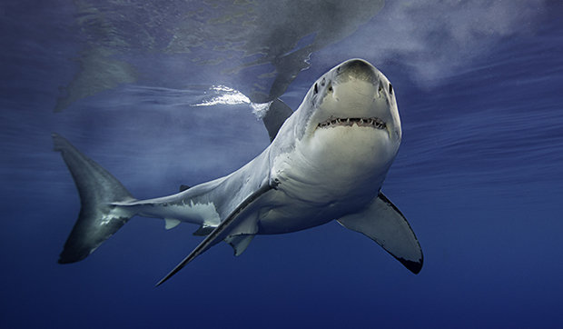

# IASC-2P02

## About me

Im very lost. my boi Alex Christie is telling me how to do this github thag but i dont really know what hes talking about.
I am trying my best.

Heres a picture of a beautiful shark boi

## Blog Post

my blog post...

Heres my [blog post](blog)

<!--	Exported from Voyant Tools (voyant-tools.org).
The iframe src attribute below uses a relative protocol to better function with both
http and https sites, but if you're embedding this into a local web page (file protocol)
you should add an explicit protocol (https if you're using voyant-tools.org, otherwise
it depends on this server.
Feel free to change the height and width values or other styling below: -->
<iframe style='width: 477px; height: 400px;' src='https://voyant-tools.org/tool/Trends/?query=humanities&query=novel&corpus=628dbd9ff50d802c3b5a994c3129421b'></iframe>

<iframe style"width: 100%; height: 1000px;" src="processing/index.html"><iframe>

